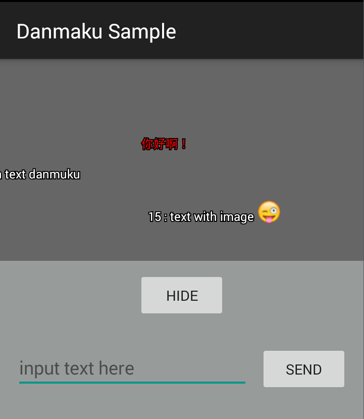

# Android Open Danmaku

一个Android的弹幕控件.
Open Danmaku is a Android widget which shows danmaku animation(https://github.com/linsea/OpenDanmaku).

# Usage

*For a working implementation of this project see the sample app.*

  1. Download the library source and refer it as a library project.

  2. Include the `DanmakuView` in your layout.

            <com.opendanmaku.DanmakuView
                android:id="@+id/danmakuView"
                android:layout_width="fill_parent"
                android:layout_height="fill_parent"
                app:start_Y_offset="0.2"
                app:end_Y_offset="0.8"
                app:max_row="4"
                app:max_running_per_row="2"
                app:pick_interval="1000"
                app:show_debug="false" />

  3. In your `Activity`:

            mDanmakuView = (DanmakuView) findViewById(R.id.danmakuView);

            // add danmaku items:
            mDanmakuView.addItem(list, true);
            mDanmakuView.addItem(new DanmakuItem(this, "Hello World", mDanmakuView.getWidth());

            //show danmaku and play animation:
            mDanmakuView.show();

            //hide and pause playing:
            mDanmakuView.hide();

            //release all playing and waiting items:
            mDanmakuView.clear();

# Customization

 * `start_Y_offset` first channel offset to the view top edge.
 * `end_Y_offset` last channel offset to the view top edge.
 * `max_row` max running channels on Y axis.
 * `max_running_per_row` max concurrent running items in one channel.
 * `pick_interval`  interval millisecond picking up an item in the backing queue to play.
 * `show_debug`  show debug info like FPS and lines between channels.

# You might also like
- [UniversalVideoView](https://github.com/linsea/UniversalVideoView) VideoView like Widget with more features.

# License

    Copyright 2015 Andy Ke <dictfb#gmail.com>

    Licensed under the Apache License, Version 2.0 (the "License");
    you may not use this file except in compliance with the License.
    You may obtain a copy of the License at

       http://www.apache.org/licenses/LICENSE-2.0

    Unless required by applicable law or agreed to in writing, software
    distributed under the License is distributed on an "AS IS" BASIS,
    WITHOUT WARRANTIES OR CONDITIONS OF ANY KIND, either express or implied.
    See the License for the specific language governing permissions and
    limitations under the License.
